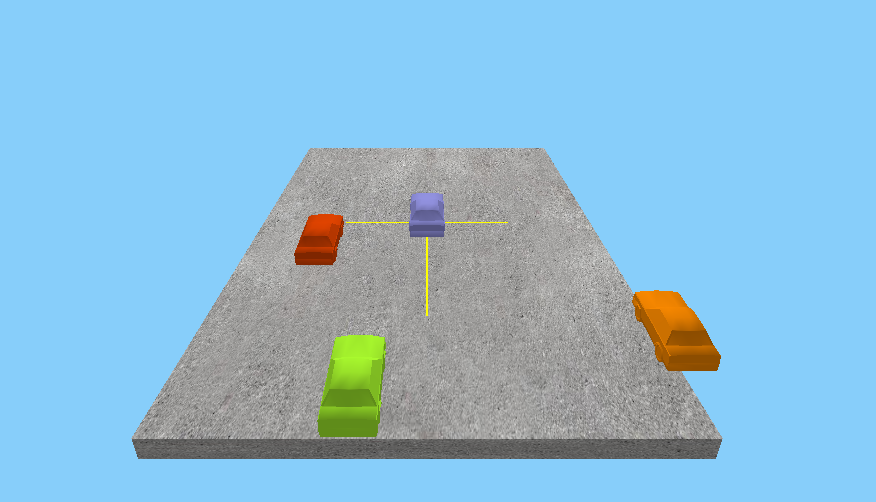

# StreetObjectsDarPlotter
A p5.js based plotter for the data coming from StreetObjectsDar

# Instructions
- A basic way to start the plotter is to run python -m http.server
- Open the webpage through the host

# Snapshot

